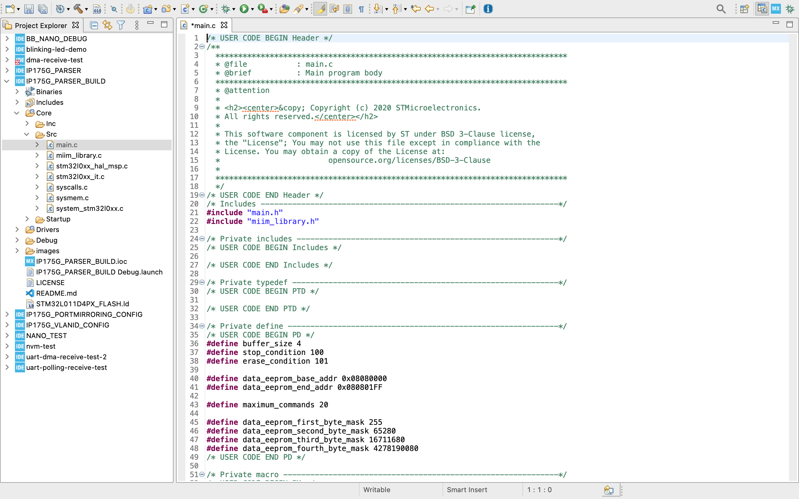
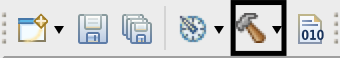
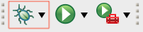
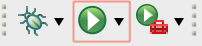

<!--
*** Thanks for checking out the Best-README-Template. If you have a suggestion
*** that would make this better, please fork the repo and create a pull request
*** or simply open an issue with the tag "enhancement".
*** Thanks again! Now go create something AMAZING! :D
***
***
***
*** To avoid retyping too much info. Do a search and replace for the following:
*** github_username, repo_name, twitter_handle, email, project_title, project_description
-->


<!-- PROJECT SHIELDS -->
<!--
*** I'm using markdown "reference style" links for readability.
*** Reference links are enclosed in brackets [ ] instead of parentheses ( ).
*** See the bottom of this document for the declaration of the reference variables
*** for contributors-url, forks-url, etc. This is an optional, concise syntax you may use.
*** https://www.markdownguide.org/basic-syntax/#reference-style-links
-->
[![Contributors][contributors-shield]][contributors-url]
[![Forks][forks-shield]][forks-url]
[![Stargazers][stars-shield]][stars-url]
[![Issues][issues-shield]][issues-url]
[![MIT License][license-shield]][license-url]
[![LinkedIn][linkedin-shield]][linkedin-url]


<!-- PROJECT LOGO -->
<br />
<p align="center">
  <a href="https://www.botblox.io/">
    
  </a>

  <h3 align="center">BotBlox Firmware</h3>

  <p align="center">
    Firmware created by BotBlox to configure settings on our products
    <br />
    <a href="https://botblox.atlassian.net/wiki/spaces/HARDWARE/overview"><strong>Explore the docs »</strong></a>
    <br />
    <br />
    <a href="https://botblox.atlassian.net/wiki/spaces/HARDWARE/overview">View Demo</a>
    ·
    <a href="https://github.com/botblox/botblox-manager-firmware/issues">Report Bug</a>
    ·
    <a href="https://github.com/botblox/botblox-manager-firmware/issues">Request Feature</a>
  </p>
</p>


<!-- TABLE OF CONTENTS -->
<details open="open">
  <summary><h2 style="display: inline-block">Table of Contents</h2></summary>
  <ol>
    <li>
      <a href="#about-the-project">About The Project</a>
      <ul>
        <li><a href="#built-with">Built With</a></li>
      </ul>
    </li>
    <li>
      <a href="#installation">Installation</a>
      <ul>
        <li><a href="#prerequisites">Prerequisites</a></li>
        <li><a href="#getting-started">Getting Started</a></li>
      </ul>
    </li>
    <li><a href="#usage">Usage</a></li>
    <li><a href="#roadmap">Roadmap</a></li>
    <li><a href="#contributing">Contributing</a></li>
    <li><a href="#license">License</a></li>
    <li><a href="#contact">Contact</a></li>
  </ol>
</details>


<!-- ABOUT THE PROJECT -->
## About The Project

Welcome to BotBlox Firmware. We designed this firmware with a singular goal: to allow our community of customers and developers to manually configure custom settings on BotBlox products, such as the SwitchBlox, our flagship Etheret switch. Our customers have requested for a while now that they want to be able to program VLAN membership, Quality-of-service, Port mirroring, etc on our products. This Firmware forms a part of our answer, along with our containerized pyhton application. 


### Built With

* [STM32CubeIDE](https://www.st.com/en/development-tools/stm32cubeide.html)

<!-- Installation -->
## Installation

You'll need to install the IDE used to configure the pin configurations of the STM32L011D4 on the SwitchBlox before you can run any firmware on it.

### Prerequisites

Download and instal [STM32CubeIDE](https://www.st.com/en/development-tools/stm32cubeide.html) - I used version 1.5.0 so I politely suggest that you use this version too.

### Getting Started

To get a local copy up and running follow these simple steps.
1. `cd` to `/path/to/STM32CubeIDE/workspace_1.5.0` directory
```sh
    cd /path/to/STM32CubeIDE/workspace_1.5.0
```
2. Clone this repo in the STM32CubeIDE directory 
```sh
   git clone https://github.com/botblox/botblox-manager-firmware.git
```
3. When you open `STM32CubeIDE` and choose `workspace_1.5.0`, you should see the project appear in the file directory within STM32CubeIDE.

The project sometimes doesn't appear in the file explorerin STM32CubeIDE and I am unsure why that is the case. I suspect this might be a bug in STM32CubeIDE if a refresh doesn't then show the cloned repo. Either way, you may have to build a new project from the `IP175G_PARSER_BUILD.ioc`, the instructions to do so are below.

1. Download the `IP175G_PARSER_BUILD.ioc`
2. In `STM32CubeIDE`, go to `File`->`New`->`STM32 Project from an Existing STM32CubeMX configuration file (.ioc)`
3. Select `/path/to/IP175G_PARSER_BUILD.ioc` and then click `Finish`. You can generate code for the project that will automatically configure the perhiperals according to the `.ioc` file.
6. From the new project's directory, replace `Core/Inc/*` with `Core/Inc/*` in this repo.
7. Now replace `Core/Src/*` in the project directory with `Core/Src/*` from this repo.
8. You now have a local version (albeit a read-only version) on your machine which you can use.
9. Compile the source code and ensure that it compiles with no errors.

<!-- USAGE EXAMPLES -->
## Usage and Debugging

This project is complex because it is difficult to know how to use the source code. One has to compile it, then use a debugger/programmer to upload the code to the STM32L011D4 chip on the SwitchBlox. 

Thankfully, STM32CubeIDE does have a lot of abstractions to help with this but the following serves as a walkthrough/debugging guide to help walk you through the steps we took to successfully program the MCU. When you open a workspace in STM32CubeIDE, you should be treated with this view.

<p align="center">
  </img>
</p>


You will note that the the project contains the `STM32L011D4PX_FLASH.ld` file. This is autogenerated by STM32CubeIDE from the `.ioc` file and is a `linker-script`. This is for the GCC compiler to know information about the target MCU. For example, it tells the compiler the memory requirements of the application, including the size of the heap and the stack that will be needed to run the application. For the purposes of just compiling the code, it is not necessary to indulge in the finer details (unless you _really_ want to).

1. Navigate to the toolbar and use the `Hammer` icon to compile the source code using the GCC compiler for C/C++.

<p align="center">
  </img>
</p>

2. If you run into errors compiling the code, I'd like to know exactly the errors you run into. Generally, I have found that compiler issues with the source code are rare, assuming you are using STM32CubeIDE as that ships with the same GNU C/C++ compiler for ARM architecture that I used to develop this. But issues here should be reported to the GitHub repo issues page on this project. In particular, we'd like to know what the `stdout` in the terminal is.

3. After compiling the source code, you are now ready to debug/program the MCU on the SwitchBlox. This requires the use of a J-Link probe, which is a hardware debugger. It should work with any J-Link debug probe though - BotBlox uses the SEGGER J-Link for example. 

4. You will need to setup the debugging/programming configurations before the compiled code can be flashed to the MCU's flash memory. To do this, click on either `Debug`->`Debug Configurations` or `Run`->`Run Configurations`.


<span style="display:flex; float:none; justify-content:center;">
  <p align="center" width="50%">
    </img>
  </p>
  <p align="center" width="50%">
    </img>
  </p>
</span>


In the modal, select either a GDB server that either autostarts when you start debugging or programming or a GDB server that is already running locally.


5. For example, if you are using SEGGER J-Link to run the GDB server on localhost before debugging, you will need to download the JLinkGDBServer application from (this link)[https://www.segger.com/downloads/jlink/#J-LinkSoftwareAndDocumentationPack]. Please ensure that you have one of the correct debug probes that they specify. After installing, run this application and fill in the details in the dialog that it shows you (i.e. set the target to STM32L011D4 or choose from the MCU selection). When it starts up, it should indicate that the client hasn't connected to it yet, which it hasn't as you need to start the debugging client in STM32CubeIDE. So to start the GDB client in STM32CubeIDE, in the debug/run configuration modal, choose the remote GDB server and select the port that the running GDB server is open to (usually default of 2331 is fine). When you run the debugging, you should see that the server is now connected to the client and will attempt to read and write the flash memory of the target MCU (STM32L011D4).
6. Alternatively, you can just autostart the GDB server when you are debugging or programming. 
7. There are numerous errors that can happen at this point, potential fixes include:
  - Ensuring that you are holding the pins of debug probe so that they are making a connection with the 6-pin J-Link header on the SwitchBlox. This is fiddly so an adhesive can be used to hold the probe in place.
  - Ensuring that the configurations of the client and the server match (that they have the correct frequency, port mapping, etc)
  - Ensuring that the debug probe used in the `Debug Configurations` or `Run Configurations` modals are set to `J-Link` and not `ST-Link`. 
  - Occasionally the STM32CubeIDE bugs out and for some reason doesn't find the correct project and/or `.elf` file that the compiler generated in your project. You may have to manually change where the debug client looks for the `.elf` file in the `Debug Configurations` or `Run Configurations` modals.
  - Another bug in STM32CubeIDE is that occasionally it flat out refuses to debug. This can be fixed with closing the IDE and opening it again and starting the procedure again.
  - It is always worthful to swap between using an autostarted GDB server and one that is running locally if one isn't working. I have found that for different OSes, local GDB server works and for others an autostarted on works. For example, on my Windows machine `STM32L011D4` is a recognisable target for the autostarted GDB server but not so for my Mac machine.
  - Get in touch! BotBlox are (unfortunately) very experienced at resolving these debugging issues now so we may be able to offer assistance, particularly if you are using a SEGGER J-Link. 
8. Once a debug thread has been opened in STM32CubeIDE by the debugging driver (assuming you used `Debug` and not `Run` at this point), you can press the `play` button and use breakpoints to step through the code. I don't suggest you do this in production but this is useful for understanding how the code works. 
9. For running in production, we suggest that you use `Run` as this will program the flash memory with the compiled code and immediately boot the MCU to run off that code.
10. At this point, you are now ready to use the SwitchBlox and program it with our (managed software!)[https://github.com/botblox/botblox-manager-software]. 
11. Your feedback at any stage is welcome and any suggestions on improvements are most welcome. We want to build a community of developers and the more people contribute, the more value this firmware and software brings to others. 

<!-- ROADMAP -->
## Roadmap

See the [open issues](https://github.com/botblox/botblox-manager-firmware/issues) for a list of proposed features (and known issues).


<!-- CONTRIBUTING -->
## Contributing

Contributions are what make the open source community such an amazing place to be learn, inspire, and create. Any contributions you make are **greatly appreciated**. Even spotting grammaticaly mistakes in the README.

1. Create your Feature Branch (`git checkout -b feature/AmazingFeature`)
2. Commit your Changes (`git commit -m 'Add some AmazingFeature'`)
3. Push to the Branch (`git push origin feature/AmazingFeature`)
4. Open a Pull Request

<!-- LICENSE -->
## License

Distributed under the MIT License. See `LICENSE` for more information.

<!-- CONTACT -->
## Contact

BotBlox email - [Contact here](mailto:josh@kapek.org)

Project Link: [https://github.com/botblox/botblox-manager-firmware](https://github.com/botblox/botblox-manager-firmware)


<!-- MARKDOWN LINKS & IMAGES -->
<!-- https://www.markdownguide.org/basic-syntax/#reference-style-links -->
[contributors-shield]: https://img.shields.io/github/contributors-anon/botblox/botblox-manager-firmware?style=for-the-badge
[contributors-url]: https://github.com/botblox/botblox-manager-firmware/graphs/contributors
[forks-shield]: https://img.shields.io/github/forks/botblox/botblox-manager-firmware?style=for-the-badge
[forks-url]: https://github.com/botblox/botblox-manager-firmware/network/members
[stars-shield]: https://img.shields.io/github/stars/botblox/botblox-manager-firmware?style=for-the-badge
[stars-url]: https://github.com/botblox/botblox-manager-firmware/stargazers
[issues-shield]: https://img.shields.io/github/issues/botblox/botblox-manager-firmware?style=for-the-badge
[issues-url]: https://github.com/botblox/botblox-manager-firmware/issues
[license-shield]: https://img.shields.io/github/license/botblox/botblox-manager-firmware?style=for-the-badge
[license-url]: https://github.com/botblox/botblox-manager-firmware/blob/main/LICENSE
[linkedin-shield]: https://img.shields.io/badge/-LinkedIn-black.svg?style=for-the-badge&logo=linkedin&colorB=555
[linkedin-url]: https://www.linkedin.com/company/botblox/

