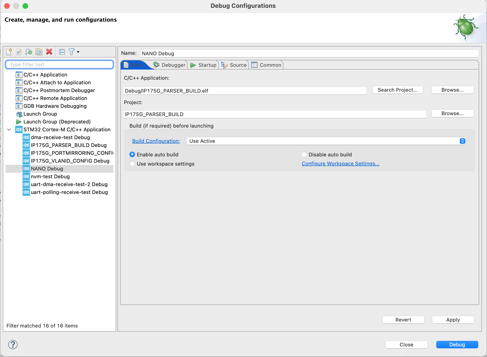
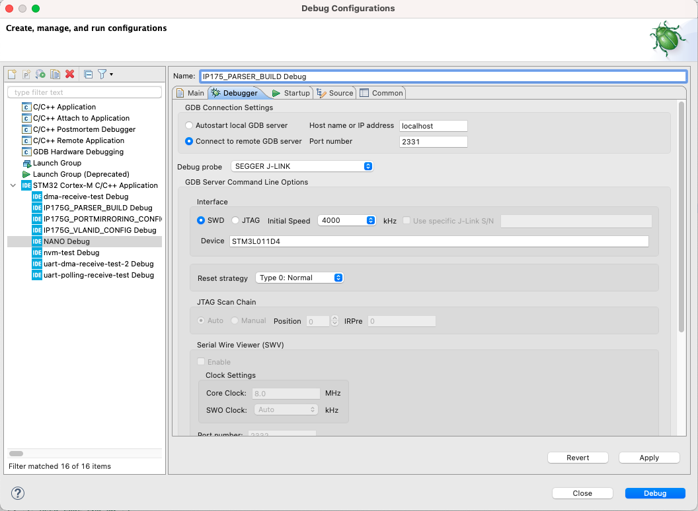
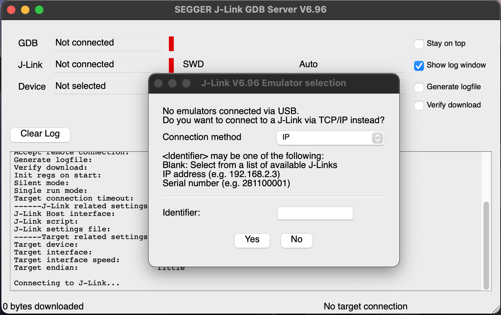

<!--
*** Thanks for checking out the Best-README-Template. If you have a suggestion
*** that would make this better, please fork the repo and create a pull request
*** or simply open an issue with the tag "enhancement".
*** Thanks again! Now go create something AMAZING! :D
***
***
***
*** To avoid retyping too much info. Do a search and replace for the following:
*** github_username, repo_name, twitter_handle, email, project_title, project_description
-->


<!-- PROJECT SHIELDS -->
<!--
*** I'm using markdown "reference style" links for readability.
*** Reference links are enclosed in brackets [ ] instead of parentheses ( ).
*** See the bottom of this document for the declaration of the reference variables
*** for contributors-url, forks-url, etc. This is an optional, concise syntax you may use.
*** https://www.markdownguide.org/basic-syntax/#reference-style-links
-->
[![Contributors][contributors-shield]][contributors-url]
[![Forks][forks-shield]][forks-url]
[![Stargazers][stars-shield]][stars-url]
[![Issues][issues-shield]][issues-url]
[![MIT License][license-shield]][license-url]
[![LinkedIn][linkedin-shield]][linkedin-url]


<!-- PROJECT LOGO -->
<br />
<p align="center">
  <a href="https://www.botblox.io/">
    
  </a>

  <h3 align="center">BotBlox Firmware</h3>

  <p align="center">
    Firmware created by BotBlox to configure settings on our products
    <br />
    <a href="https://botblox.atlassian.net/wiki/spaces/HARDWARE/overview"><strong>Explore BotBlox Wiki »</strong></a>
    <br />
    <br />
    <!-- <a href="https://botblox.atlassian.net/wiki/spaces/HARDWARE/overview">View Demo</a>
    · -->
    <a href="https://github.com/botblox/botblox-manager-firmware/issues">Report Bug</a>
    ·
    <a href="https://github.com/botblox/botblox-manager-firmware/issues">Request Feature</a>
  </p>
</p>


<!-- TABLE OF CONTENTS -->
<details open="open">
  <summary><h2 style="display: inline-block">Table of Contents</h2></summary>
  <ol>
    <li>
      <a href="#about-the-project">About The Project</a>
      <ul>
        <li><a href="#built-with">Built With</a></li>
      </ul>
    </li>
    <li>
      <a href="#installation">Installation</a>
      <ul>
        <li><a href="#prerequisites">Prerequisites</a></li>
        <li><a href="#getting-started">Getting Started</a></li>
      </ul>
    </li>
    <li><a href="#usage">Usage</a></li>
    <li><a href="#roadmap">Roadmap</a></li>
    <li><a href="#contributing">Contributing</a></li>
    <li><a href="#license">License</a></li>
    <li><a href="#contact">Contact</a></li>
  </ol>
</details>


<!-- ABOUT THE PROJECT -->
## About The Project

Welcome to BotBlox Firmware. We designed this firmware with a goal: allow our community of customers and developers to configure custom managed settings on BotBlox products, such as the SwitchBlox, which is our flagship Etheret switch. For a while now, our customers have requested that to ability to program VLAN membership, Quality-of-service, Port mirroring and other networking options on our products. Our Firmware and (Software)[https://github.com/botblox/botblox-manager-software] is our answer to that question. 


### Built With

* [STM32CubeIDE](https://www.st.com/en/development-tools/stm32cubeide.html)

<!-- Installation -->
## Installation

You'll need to install the STM32CubeIDE so you can compile and program the source code in one place. Other toolchains can be used but this is what is recommended by us. 

### Prerequisites

Download and instal [STM32CubeIDE](https://www.st.com/en/development-tools/stm32cubeide.html) - we used version 1.5.0 so I politely suggest that you use this version too.

### Getting Started

To get a local copy up and running follow these simple steps.
1. `cd` to `/path/to/STM32CubeIDE/workspace_1.5.0` directory
```sh
    cd /path/to/STM32CubeIDE/workspace_1.5.0
```
2. Clone this repo in the STM32CubeIDE directory 
```sh
   git clone https://github.com/botblox/botblox-manager-firmware.git
```
3. When you open `STM32CubeIDE` and choose `workspace_1.5.0`, you should see the project appear in the file directory within STM32CubeIDE.

The project sometimes doesn't appear in the file explorer within STM32CubeIDE: we are unsure why that is sometimes the case. I suspect this might be a bug in STM32CubeIDE that refreshs in the file explorer don't always show new projects added in the workspace directory. If this is the case for you, you need to build a new project starting from the `IP175G_PARSER_BUILD.ioc`, the instructions to do so are below.

1. Download the `IP175G_PARSER_BUILD.ioc`
2. In `STM32CubeIDE`, go to `File`->`New`->`STM32 Project from an Existing STM32CubeMX configuration file (.ioc)`
3. Select `/path/to/IP175G_PARSER_BUILD.ioc` and then click `Finish`. You can generate code for the project that will automatically configure the perhiperals according to the `.ioc` file.
6. From the new project's directory, replace `Core/Inc/*` with `Core/Inc/*` in this repo.
7. Now replace `Core/Src/*` in the project directory with `Core/Src/*` from this repo.
8. You now have a local, read-only version on your machine.
9. Compile the source code and ensure that it compiles with no errors.

<!-- USAGE EXAMPLES -->
## Usage and Debugging

This project can be complex to those unfamiliar with embedded programming because it is difficult to know how to use the source code. One has to compile it, then use a debugger/programmer to upload the code to the STM32L011D4 chip on the SwitchBlox. 

Thankfully, STM32CubeIDE does plenty of (optional) abstractions to make it easier but the following section in this README serves as a walkthrough to guide you through the steps we took to successfully program the MCU on the SwitchBlox. When you open a workspace in STM32CubeIDE, you should be treated with this view.

<p align="center">
  </img>
</p>

The project contains the `STM32L011D4PX_FLASH.ld` file. This is autogenerated by STM32CubeIDE from the `.ioc` file and is a `linker-script`. This is for the GCC compiler, which comes as part of the toolchain for STM32CubeIDE, to lookup certain metadata about the target MCU. For example, the size of the heap and the stack that will be needed to run the application. For the purposes of just compiling the code, it is not necessary to indulge in the finer details (unless you _really_ want to).

1. Navigate to the toolbar and use the `Hammer` icon to compile the source code using the GCC ARM compiler for C/C++.

<p align="center">
  </img>
</p>

2. If you run into errors compiling the code, we'd like to know the errors you run into. Generally, I have found that compiler issues with the source code are rare, assuming you are using STM32CubeIDE as that ships with the same GNU C/C++ compiler for ARM architecture that we used to develop this. Any issues with compiling are likely to be workflow issues as opposed to syntax mistakes. But issues here should be reported to the GitHub repo issues page on this project. In particular, we'd like to know what the `stdout` in the terminal is and how you can replicate the error.

3. After compiling the source code, you are now ready to debug/program the MCU on the SwitchBlox. This requires the use of a J-Link probe, which is a hardware debugger. It should work with any J-Link debug probe though - we used the SEGGER J-Link. 

4. You will need to setup the debugging/programming configurations before the compiled code can be flashed to the MCU's flash memory. To do this, click on either `Debug`->`Debug Configurations` or `Run`->`Run Configurations`.

<div>
  <p align="center">
    </img>
    <p align="center">Icon to select the debugging configuration</p>
  </p>
  <p align="center">
    </img>
    <p align="center">Icon to select the running configuration</p>
  </p>
</div>

This will open up a modal, where you can select the project settings so the debugger knows where to look for the compiled .elf file.

<div>
  <p align="center">
    </img>
    <p align="center">Here you can select the project where you source code resides and the target .elf file (built when you compiled the source code)</p>
  </p>
</div>

5. You want to select the project which corresponds to the source code in this repo (you may have changed the name but we have used `IP175G_PARSER_BUILD` as the name of our project). You will need to select the compiled `.elf` file for `C/C++ Application` and the project name in `Project`. Typically, it is a good idea in the `Build (if required) before launching` section to select the radio button for `Enable auto build` in case you make change in the source code and need to compile again, this will mean that when you click the `Debug` or `Run` icons, that the source code is saved and compiled again before the new `.elf` file is selected by the debugger.

<div>
  <p align="center">
    </img>
    <p align="center">In this modal, you can change the settings of the debugger server</p>
  </p>
</div>

6. In `GDB Connection Settings`, you can select either `Autostart local GDB server` or `Connect to remote GDB server` and then specify the host and port. Either of these options is fine depending on your setup. The simplest way is to select `Autostart local GDB server`. However, if this fails to spin up the GDB server, you can start it up manually and select `Connect to remote GDB server`. The software to run a remote GDB server is at (this link)[https://www.segger.com/downloads/jlink/#J-LinkSoftwareAndDocumentationPack].

In the selector for `Debug probe`, select `SEGGER J-LINK`. We have not tested the `ST-LINK` probe so can't guarantee that will work

In the panel for `Interface`, select `SWD` radio button. The targert device should already be set to `STM32L011D4`.

Before you press `Apply` and then `Debug`, it is worth going over the process for setting up your own remote GDB server for those that chose the option. For those that chose `Autostart local GDB server`, you can ignore the following step.


7. As mentioned previously, you will need to download the `JLinkGDBServer` application from (this link)[https://www.segger.com/downloads/jlink/#J-LinkSoftwareAndDocumentationPack]. Please ensure that you have one of the correct debug probes from the list they specify (SEGGER J-LINK for instance). After installing this application, run `JLinkGDBServer` and fill in the details in the dialog that it shows you (i.e. set the target to STM32L011D4 or choose from the MCU selection). See below for full dialog. 

<div>
  </img>
</div>

You will notice that it even generates CLI options that you can use to run the server programmatically. In fact, this is what STM32CubeIDE does when it autostarts a GDB server if you select that option. If you press `Ok`, you will be presented with the logging output from the server. 

<div>
  </img>
</div>

It should indicate that the client hasn't connected to it yet and (persumably) that you haven't connected the debugger to the machine you are developing on. The former is because you need to select `Apply` and then `Debug` in the debugger settings modal discussed in (6). The latter is because the server does require the physical probe to be read by the development machine in order to use it (obviously).


8. There are numerous errors that can happen at this point: here are some potential fixes:
  - Ensuring that you are holding the pins of debug probe so that they are making a connection with the 6-pin J-Link header on the SwitchBlox. This is fiddly so an adhesive can be used to hold the probe in place.
  - Ensuring that the configurations of the client and the server match (that they have the correct frequency, port number, etc)
  - Ensuring that the debug probe used in the `Debug Configurations` or `Run Configurations` modals are set to `J-Link` and not `ST-Link` or other options. 
  - Occasionally the STM32CubeIDE bugs out and for some reason doesn't find the correct project and/or `.elf` file that the compiler generated in your project. You may have to manually change where the debug client looks for the `.elf` file in the `Debug Configurations` or `Run Configurations` modals (see above).
  - Another bug in STM32CubeIDE is that occasionally it flat out refuses to debug. This can be fixed with closing the IDE and opening it again and starting the procedure again.
  - It is always worthwhile to swap between using an autostarted GDB server and one that is running locally, if one isn't working. I have found that for different OSes, local GDB server works and for others an autostarted on works. For example, on my Windows machine `STM32L011D4` is a recognisable target for the autostarted GDB server but not so for my Mac machine!
  - Get in touch! BotBlox are (unfortunately) very experienced at resolving these debugging issues now so we may be able to offer assistance, particularly if you are using a SEGGER J-Link. 

9. The next stages depend on your intentions as the developer. If you selected `Run` instead of `Debug`, the firmware will be flashed to the MCU's flash memory. At that point, you are now ready to configure managed settings on the SwitchBlox using our (managed software!)[https://github.com/botblox/botblox-manager-software].

10. If you selected `Debug`, then a debug thread will open where you can add breakpoints and investigate how the code works. This is for developing purposes; if you are planning to use the firmware in production, this step is not needed.  

11. Your feedback at any stage is welcome and any suggestions on improvements are most welcome. We want to build a community of developers and the more people contribute, the more value this firmware and software brings to others. 

<!-- ROADMAP -->
## Roadmap

See the [open issues](https://github.com/botblox/botblox-manager-firmware/issues) for a list of proposed features (and known issues).


<!-- CONTRIBUTING -->
## Contributing

Contributions are what make the open source community such an amazing place to be learn, inspire, and create. Any contributions you make are **greatly appreciated**. Even spotting grammaticaly mistakes in the README.

1. Create your Feature Branch (`git checkout -b feature/AmazingFeature`)
2. Commit your Changes (`git commit -m 'Add some AmazingFeature'`)
3. Push to the Branch (`git push origin feature/AmazingFeature`)
4. Open a Pull Request

<!-- LICENSE -->
## License

Distributed under the MIT License. See `LICENSE` for more information.

<!-- CONTACT -->
## Contact

BotBlox email - [Contact here](mailto:josh@kapek.org)

Project Link: [https://github.com/botblox/botblox-manager-firmware](https://github.com/botblox/botblox-manager-firmware)


<!-- MARKDOWN LINKS & IMAGES -->
<!-- https://www.markdownguide.org/basic-syntax/#reference-style-links -->
[contributors-shield]: https://img.shields.io/github/contributors-anon/botblox/botblox-manager-firmware?style=for-the-badge
[contributors-url]: https://github.com/botblox/botblox-manager-firmware/graphs/contributors
[forks-shield]: https://img.shields.io/github/forks/botblox/botblox-manager-firmware?style=for-the-badge
[forks-url]: https://github.com/botblox/botblox-manager-firmware/network/members
[stars-shield]: https://img.shields.io/github/stars/botblox/botblox-manager-firmware?style=for-the-badge
[stars-url]: https://github.com/botblox/botblox-manager-firmware/stargazers
[issues-shield]: https://img.shields.io/github/issues/botblox/botblox-manager-firmware?style=for-the-badge
[issues-url]: https://github.com/botblox/botblox-manager-firmware/issues
[license-shield]: https://img.shields.io/github/license/botblox/botblox-manager-firmware?style=for-the-badge
[license-url]: https://github.com/botblox/botblox-manager-firmware/blob/main/LICENSE
[linkedin-shield]: https://img.shields.io/badge/-LinkedIn-black.svg?style=for-the-badge&logo=linkedin&colorB=555
[linkedin-url]: https://www.linkedin.com/company/botblox/

